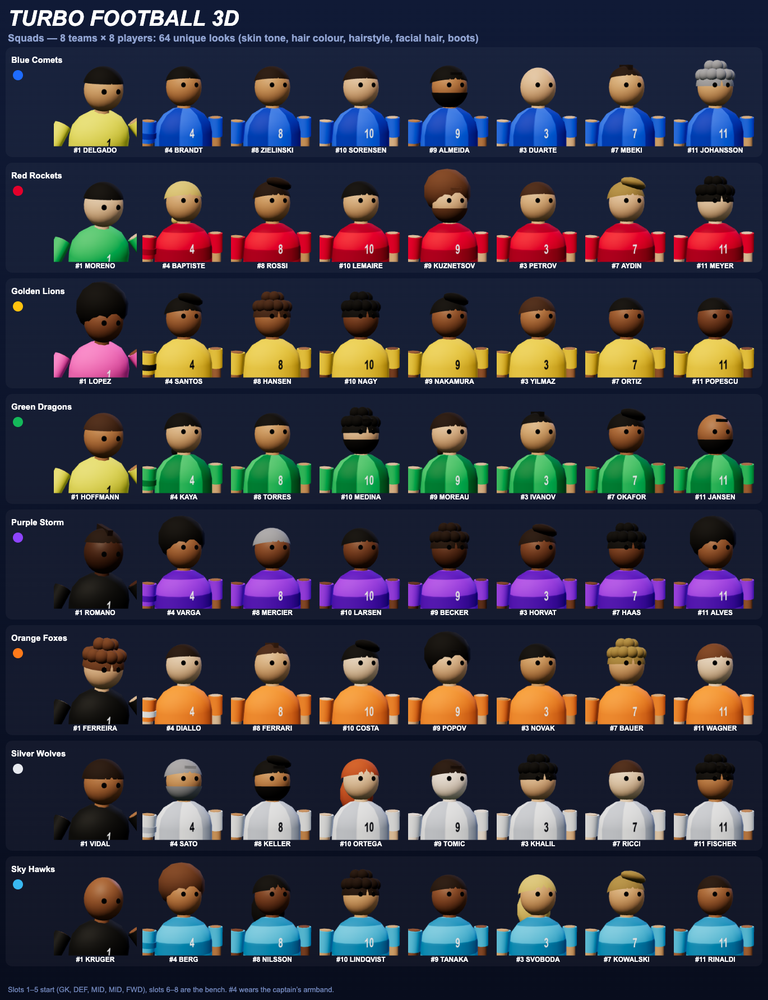
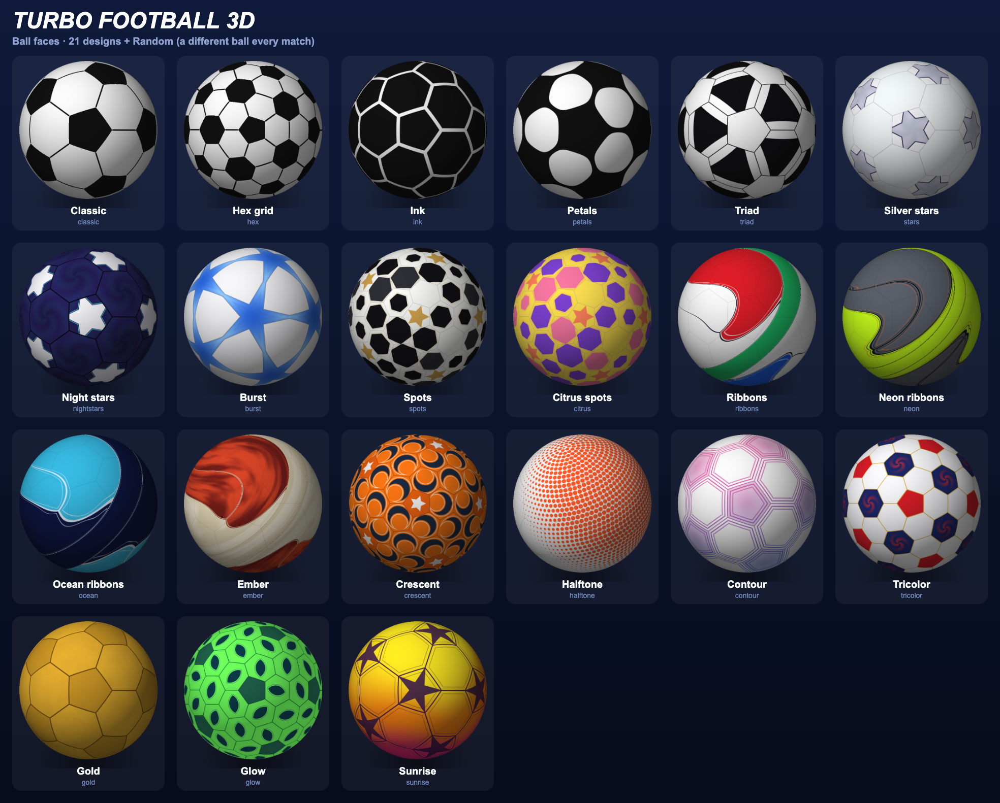

# Turbo Football 3D

An arcade football game (3- to 11-a-side) that runs in the browser, built with [three.js](https://threejs.org) and Vite.
The pitch is enclosed by advertising boards, so there are no throw-ins or corners — just non-stop action,
plus fouls, free kicks, penalties and shoot-outs.

**Play it now: https://jchristov.github.io/football3d/** (installable and playable offline after the first visit).

## Run it

```bash
npm install
npm run dev                  # http://localhost:5100 (change in vite.config.js)
npm test                     # unit and simulation tests (node --test)
npm run build                # production bundle in dist/
npm run preview
```

## Hosting

The game is a static site (`npm run build` → `dist/`). Every push to `main` runs the tests and deploys `dist/` to GitHub Pages
with `.github/workflows/pages.yml`. On static hosting the online *Room* tab and QR rooms are not available (they need the relay in
`npm run dev` / `npm run preview`); online play with invitation codes (peer to peer) works everywhere, over HTTPS too.

## Game modes

- **1 Player**, **2 Players** (local, shared keyboard) or **CPU vs CPU** (watch).
- **Six difficulty levels:** *Kids*, *Beginner*, *Easy*, *Normal*, *Hard*, *Expert*. The two lowest slow the CPU right down (it reacts late, hardly tackles, shoots rarely and badly, and its keeper saves little), and in a 1-player match they also help you: your players reach the ball from further away (+50% on Kids, +35% on Beginner, +15% on Easy), so first touches and tackles land. A team's star rating still shifts the CPU a little, and a career title raises the level one step.
- **CPU toughness (Settings → Match, 1-player only):** five steps, *Very easy*, *Easy*, *Normal* (default), *Hard*, *Relentless*, tune the CPU on top of the difficulty level: speed, reaction time, tackling, keeper saves, shooting range and aim.
- **Possession is a duel.** Running into the ball takes it, but a defender touching a carrier must win the ball: the chance depends on his tackle skill and on how open the carrier is (facing the tackler, shielding with his body, sprinting). A lost duel gives the defender a short cooldown; the carrier gets a quick re-touch window and a tighter dribble, so a ball in possession is harder to lose by chance; a player who has just won or received the ball gets a short settling window in which he is much harder to rob, the carrier keeps the ball closer to his feet, and hold-up play with the body between ball and challenger is rewarded; players no longer overlap, the carrier is pushed less than the tackler.
- **Player figures:** shoulders and arms are covered by the kit, with ears, nose, mouth and eyes (white, iris, pupil). Eye colour is part of a player's look (brown, hazel, green, blue, grey, usually matching hair and skin tone) and can be edited in the squad editor.
- **Friendly**, **Cup** (8-team knockout; level games go to a penalty shoot-out), **League** (6 teams, round robin) or **Career** (see below).
  Cup and league matches last 2 minutes; other results are simulated from team ratings.
- 8 teams with ratings (1-5 stars) that affect CPU skill; kits automatically avoid colour clashes.
- Time of day (day / dusk / night, floodlights at dusk and night) and weather (clear / rain / snow, or random).
  Rain makes the ball quicker and players slide; snow slows the ball and reduces grip.

## Controls

| | Player 1 / single player | Player 2 |
| --- | --- | --- |
| Move | `WASD` (single player also Arrows) | Arrows |
| Sprint | `Shift` | Right `Shift` |
| Shoot (hold for power) | `Space` | `Enter` |
| Curler (hold with shoot) | `R` | `'` |
| Pass (hold = lob / cross) | `F` | `.` |
| Slide tackle | `E` | `,` |
| Switch player | `Q` / `Tab` | `/` |

**Mouse** (single player, Settings can switch it off): move the pointer and the player runs to it (a far pointer means sprint; keys win while pressed, and the pointer steers again a few seconds after it moves); hold the left button to shoot at the pointer, right button to pass (hold = lob), middle button slide tackle, wheel switches player.

**Phones and tablets** (no keyboard): the game detects them (`?touch=1` forces this on a computer) and plays without any shortcut. Hold the phone sideways. *Drag anywhere on the left half* for a floating stick (the further you push, the faster you run; push to the edge to sprint); on the right *SHOOT* (hold to charge) and *PASS* (hold = lob) light up when you have the ball, *TACKLE* and *SWITCH* when you do not, and *CURL* is a toggle for the next shot. A hint explains this at the first kick-off. Top left: ⏸ pause, 🎥 camera, ⏪ replay; top right: 🔁 team changes, ⛶ full screen, 🔊 sound. The pause menu has *Resume*, tactics and substitutions, settings, camera, autopilot and *Quit match* (two taps); *tap the AUTOPILOT badge* to take control back; replays have a *Skip* button. The action buttons on the right are large (about 15% of the screen height, adjustable in Settings → Touch controls). Everything else is smaller than on a computer (panels and HUD scale with the screen height, Settings → Touch controls sizes the buttons), shortcut hints, key bindings and the 2-player mode are hidden, and the start button stays at the bottom of the menu. *Tap a player of your team* to take control of him (he stays yours for about 3 s before the automatic switching resumes). On a laptop with a touch screen the stick and buttons appear at the first touch. Portrait mode asks you to turn the device sideways.

Shared: `T` autopilot (single player), `V` instant replay, `N` commentary on/off, `C` camera (broadcast → follows the selected player → follows the ball → bird's-eye; a toast names it), `P` / `Esc` pause (shows live match stats), `M` mute, `Enter` confirms menus.

## Rules and mechanics

- **Fouls:** a slide tackle from behind or on a player without the ball is a foul → free kick, or a **penalty** inside the box.
  Free kicks are taken by the nearest player (human or CPU) against a two-man wall.
- **Penalties:** left/right aims, hold shoot for power — a full bar skies it.
- **Shoot-out:** best of five, then sudden death, with the usual early finish.
- **Headers & volleys:** with a ball in the air at head height, *shoot* heads it where you aim (towards goal if you are roughly facing it) and *pass* nods it to a teammate; hold the button for a harder header. Balls that come at head height are otherwise still headed automatically. Shooting an airborne ball lower down is a volley.
  Lobbed passes are timed to arrive at head height. Crossing AI players and keepers deal with high balls too.
- **Shot strength:** hold shoot (or the SHOOT button) to charge the power bar (green → red, white glow when full): a tap is a gentle side-foot shot, a full charge a rocket.
- **Sticky dribbling:** a carrier running with the ball keeps it at his feet — it follows his speed and direction through turns instead of trailing behind; a hard kick or a tackle still breaks it loose.
- **Curlers:** shots with spin bend in flight, aimed at the far post.
- **Replays:** every goal is replayed from two cameras (skip with `Space`/`Enter`); `V` replays the last 8 seconds.

## Squads, looks, tactics

- **Squads:** every team has 8 players: 5 starters (GK, DEF, MID, MID, FWD) and 3 on the bench, each with a squad number, a unique surname
  and the captain's armband on #4. All 64 players look different: 10 skin tones (a continuous scale), 12 hair colours, 11 hairstyles,
  facial hair and boot colours. Each team has a "look profile", so squads feel distinct. A look is derived from team and slot,
  so a player always looks the same.
- **Squads & looks editor** (menu → *Squads & looks*): rename a player and change skin tone, hair colour, hairstyle, facial hair and boots, with a
  turnable live preview. Saved in the browser and used everywhere, including cups and leagues.
- **Team size:** 3, 4, 5, 7, 9 or 11 a side. The pitch, goals area, camera, bench (2–5 subs) and the formations (five per size, e.g. 4-4-2 or 1-2-1) adapt to the size. Pick it in the menu; the match restarts on a rebuilt pitch.
- **Tactics:** five formations per team size (5-a-side: 1-2-1, 2-2, diamond, all-out attack, park the bus) and three pressing styles (sit back / balanced / high press).
  Pick them in the menu or change them in a match (pause → *Tactics & subs*). The CPU chooses a style that suits its strength, and
  all teams push forward when trailing and drop back when leading.
- **Substitutions:** up to 5 per match, on the pause screen and at half time. Tired players (see the energy bars) rest on the bench and recover.
  The CPU substitutes its own tired players.
- **Half time:** matches with a human player stop at half length for a tactics and substitutions break.
- **Offside** (optional, menu): attackers beyond the ball and the second-last defender when a pass is played are flagged when they touch it,
  giving the defenders a free kick. Your offside line is drawn on the pitch.



## Match flow, commentary and the ball

- **Two halves.** A match is two timed halves (the clock shows the time left in the current half). The first half ends with the referee's
  long triple whistle, then a half-time break with stats, tactics and substitutions; for the second half the **teams switch ends**, the
  other team kicks off, and players get some energy back. The match ends with another final whistle (also before a penalty shoot-out).
  A watched CPU-vs-CPU match carries on from half time by itself.
- **Big shirt numbers.** Huge outlined digits on the back (and front) of every shirt, readable from the broadcast camera, with the surname above.
- **Spoken commentary (text-to-speech).** The caption lines are read aloud with **Microsoft Natural voices only** (the default is Andrew Multilingual when installed) (available in Microsoft Edge; the list is empty in other browsers). Pick the voice, speed and volume in
  *Settings → Spoken commentary*. Goals interrupt minor chatter, speech stops when you pause, mute or
  switch commentary off (`N`).
- **Shortcuts.** `B` toggles the bird's-eye minimap (bottom right), `H` opens a help screen listing every key (the game pauses), `O` opens Settings, `U` opens team changes. `S` stays "move down" in the WASD scheme. All shortcuts are listed in Settings, the help screen and the on-screen hint.
- **Everything is remembered.** All settings are saved in the browser's localStorage: audio, voice, ball face and size, quality, team size, formation, offside, match length, key bindings, squad edits, panel opacity, minimap / events panel, mute, the camera you picked with `C`, and the start-screen choices (mode, competition, difficulty, time of day, weather, both teams).
- **Panel opacity.** One slider in Settings sets the translucency of all panels: the overlays (menu, settings, tactics, squads, help...) and the on-screen widgets (score, commentary, hints, minimap, events).
- **Team colours.** Team names in captions, banners, results and tables are shown in the team's colour.
- **Yellow and red cards.** The referee judges every foul: reckless tackles from behind, fouls in the box, stopping a run at goal and repeat offenders are booked or sent off more often. A card is shown on screen (with commentary and spoken line), booked players carry a 🟨 on their name tag and play more carefully, a second yellow is a red, and a sent-off player leaves for good so his team plays a man short (a sent-off keeper is replaced in goal by an outfield player). A team is never reduced below about two thirds of its players (7 of 11, 3 of 5, 2 of 3); beyond that only yellow cards are shown. Cards appear in the match stats and the tactics panel.
- **Player bars.** `G` (or Settings) toggles them. The player with the ball gets a floating card under his feet with the two bars, human-controlled players also get them at the bottom of the screen, and the tactics / substitutions view shows them for every player on the pitch and the bench. The two bars are: overall energy (amber, with the sprint tank as a thin line under it) and the player's speciality as one segmented, colour-coded bar: defending (green), midfield (blue) and attacking (red) shares, with the strongest one named (DEFENDER / MIDFIELDER / ATTACKER). Goalkeepers are KEEPERS and all green by default; about every other one has an extra quality, a sweeper-keeper (some blue) or a keeper with a long throw (a little red). The speciality follows the squad member's natural role with some personal variation and it matters: defenders win slide tackles and clearing headers more often, midfielders pass more accurately, attackers shoot and head the ball harder (roughly -13% to +9% around average). Playing outside the natural role (e.g. a defender up front after a formation change) costs 6% and is flagged with ⚠ on the ball-carrier card and in the team view.
- **Clock direction.** Settings → Match: count the match clock up (elapsed time, continuing into the second half) or down (time left in the half, the default).
- **Throw-ins, corners and goal kicks.** The boards no longer stop the ball: when it crosses a touchline the other team gets a throw-in (taken by hand: the thrower stands on the line with the ball held overhead in both hands and throws it in with a proper arm swing), over the goal line outside the goal it is a goal kick for the defenders if an attacker touched it last (the keeper boots it upfield) and otherwise a corner for the attackers (lofted into the box by the CPU; humans take it with the normal kick keys). Banner, commentary and a *Corners* row in the stats. Settings → Match can switch it off, then the ball bounces off the boards as before.
- **CPU play styles.** Every CPU team has a style that shapes its formation, pressing and decisions: *Possession* (Blue Comets, Sky Hawks: short passes, patient), *Counter-attack* (Golden Lions, Orange Foxes: deep, direct and quick), *Long ball* (Purple Storm: lobs to the strikers), *High press* (Red Rockets, Silver Wolves: hunts the ball) and *Balanced* (Green Dragons). The style shows in the team picker tooltips and on the team sheet; a human team plays balanced. Kick-off line-ups now pick the players whose natural role fits the formation, so a CPU team playing a 5-3-2 really starts with five defenders.
- **Installable, works offline, adapts to your machine.** The game ships a web manifest and a service worker (production build only): after the first visit it starts without a network, and browsers offer *Install* (also a *📲 Install the game* button in the menu). `X` or the ⛶ button toggles full screen. If the frame rate stays below ~40 fps for several seconds the graphics quality is lowered one step (high → medium → low, never raised again by itself); switch that off in Settings → Graphics.
- **Mud, wind and stadium looks.** Two more weather types: *Mud* (heavy going, slower, more tiring, the ball stops quickly, a muddy pitch texture) and *Wind* (a random compass direction pushes a ball that is in the air; blowing dust streaks, and a toast tells you where it blows from). Three stadium looks, *Arena*, *Classic* (brick stands, red-white crowd, local sponsors) and *Neon* (dark stands, neon crowd and boards), or Random for both weather and stadium.
- **Save a replay as a video.** During any replay the *💾 Save clip* button restarts it and records the 3D picture (MediaRecorder, WebM / MP4 depending on the browser) and downloads it when the replay ends; on the full-time screen *💾 Save goal clip* plays the goal of the match and saves it. No sound and no HUD in the file.
- **Match analysis.** The full-time screen has an expandable *Match analysis*: a heat map per team (all attacking to the right), a shot map (stars for goals, filled dots on target, rings off target, team 2 mirrored), a passing network per team (average positions, circle size = touches, line width = completed passes) and a table with distance covered, top passers and top runners. It is also shown to the online guest.
- **VAR.** Every penalty and every straight red card is checked on the monitor: a *VAR CHECK* box with a progress bar and the referee's gesture (about 3.5 s), then the verdict: *Decision stands* or *Decision changed*. A penalty can be overturned because the contact was outside the box (free kick on the edge of the area) or because there was no foul (goal kick); a red card for a soft challenge can be reduced to a yellow (a last-man foul rarely is, and a player who is already booked cannot be saved). Second yellows and ordinary yellow cards are not reviewed. The check is in the commentary, the announcer, the events panel (📺) and online for the guest too. Settings → Match can switch VAR off.
- **Career mode.** Pick *Career* in the competition row: a league season of six teams, home and away (ten matchdays of 2 minutes). The *career hub* between the matches shows the next fixtures, a **form guide** (your last five results as W / D / L), the discipline table, the league table, the **top scorers** of the whole league (the other fixtures are simulated, with goals handed out to forwards first), and **My squad**: appearances, goals, assists, average rating and cards of every player this season, and goals / appearances over the career. The squad is persistent: suspensions, injuries and cards carry over, and a player's **form** counts: with an average mark of 7.4+ over his last three matches he is 🔥 in form (skills +5%), 5.6 or less means ❄️ out of form (-5%), with milder steps in between. After matchday ten you get the season summary (champions, golden boot, your player of the season); *Start season N* keeps the squad and all statistics but plays a fresh league with a new fixture list, and a title raises the difficulty one level. The career is saved in the browser after every match: *Continue career* on the start screen picks it up, and *Start a new career* (two clicks) erases it.
- **Join by QR code.** Hosting an online *Room* shows a QR code and a link (`…/?join=CODE`) with the address of the game and the room: a friend scans it with the phone camera, the game opens and joins the room at once, and *Copy link* / *Share…* send the same link by chat. When the host opened the game on `localhost`, the server tells the page its network addresses (`/__relay/info`, home networks before VPN addresses) and a drop-down chooses the one the friend can reach. The invitation of *Host with codes* has a link and QR code too (`…/#invite=FB3D1…`), which fills in the invitation and creates the reply for the friend. Phones need to be on the same network as the host.
- **One button size.** Text buttons are 44 px tall on every screen, dense editor controls (key bindings, squad editor, tabs) 34 px, round icon buttons 44 px; tiles with pictures size themselves.
- **Accessibility.** Settings → Accessibility: a colour-blind-safe palette (speciality bars blue / yellow / orange, red cards striped, ▲▼ marks on ratings), a size slider for the on-screen widgets and panels (80–150%) and *Reduce motion* (no animations or confetti, still crowd; follows the system setting until you choose).
- **Stadium announcer.** A second, deeper and slower PA voice (same Natural voice, lower pitch) announces the welcome with the captains, goals with the score, cards, substitutions, half time and full time. He waits until the commentator is quiet and never interrupts; switch him off in Settings.
- **Online play.** Pick *🌐 Online* in the menu. Two ways to connect:
  - **Room (same network / same computer):** the game server (`npm run dev` or `npm run preview`) has a tiny built-in room relay. The host presses *Create a room* and gets a 4-character code; the friend opens the same address (on another computer use the host's network address, e.g. `http://192.168.1.20:5100`, instead of `localhost`) and joins with the code. Nothing to copy and paste, and it works where WebRTC is blocked (VPNs, strict routers, two browsers on one computer). Only available when the game runs from that server, not from static hosting.
  - **Codes (peer to peer, internet):** the browsers connect directly with WebRTC data channels and there is no server: the host creates an invitation code, sends it to the friend (chat, mail ...), the friend pastes it, creates a reply code and sends it back, the host pastes that and the link opens. Each invitation works once. For the internet tick *Internet play* on **both** computers (a public Google STUN server is then used to find the way through routers; no match data goes through it); VPNs and strict networks can still block it, then use a room.

  In both cases the host runs the whole match and chooses teams, length and rules; the friend controls the other team's player with the same keys (and sees the match from ~30 snapshots per second, blended over a 0.1 s buffer). Banners, cards, commentary, sound effects, the events log and the end screen are mirrored. Only the host can pause or replay; if the friend leaves, the CPU takes over his team.
- **Injuries.** Hard challenges and fouls (more often from behind, and when the victim is tired) can injure a player: he limps on at about 60% pace without sprinting, with a toast, commentary line, 🩹 marker in the team view and an entry in the events log. The CPU substitutes an injured player at once; as a human you decide (an injured bench player cannot come on, and a team loses at most two players per match). In cup and league injured players miss the next match. Can be switched off in Settings.
- **Team sheets before kick-off.** Every human match opens with both line-ups (formation, pressing, position and speciality bars, bench, suspended players). `Enter` kicks off, `📋 Tactics & subs` lets you change the formation first; Settings can switch the screen off. Starters are seated by their natural role, so a normal line-up has nobody out of position.
- **Ratings and man of the match.** Every player who played gets a mark from 3.0 to 10.0 (base 6.0, plus goals, assists, shots on target, passing, tackles, saves and headers, minus fouls, cards and own goals, adjusted by the team result and clean sheets). The full-time screen shows the man of the match (from the winning side) and an expandable list of all ratings for both teams.
- **Suspensions (cup and league).** A red card, or a third yellow card collected over the tournament, means the player misses the next match (the yellow count then starts again). The fixture screen shows a discipline table with the cards and who is suspended; suspended players are not in the squad for the match.
- **Team changes.** `U` (or the 🔁 button) opens formation / pressing / substitutions at any time (also when watching CPU vs CPU, where both sides are listed) and pauses the match; the same panel opens at half time. Sent-off players cannot be replaced.
- **Settings during a match.** The ⚙ button (or `O`) opens Settings mid-game; the match pauses and resumes when you close it.
- **Goal-post sound.** Posts and the crossbar play real wood/metal impact samples scaled by the speed of the hit.
- **Ball size.** Sizes 1–5 with the real diameters (14 to 22–23 cm): smaller balls are smaller and a little harder to control. Menu or Settings.

## Ball faces

21 procedurally generated ball designs plus **Random** (a different ball for every match, never the same twice in a row).
Pick one in the menu or in Settings; the choice is saved. Faces are painted per pixel from the direction on the sphere, so there is no
stretching at the poles and no seam. A few have special materials: *Gold* is glossy and *Glow* is emissive, so it shines at night.



## Presentation

- **Players:** jointed models (thigh/shin, upper arm/forearm) with run cycle, kick swing, slide tackle, header jump, goalkeeper stance, dives and
  catches, celebrations, and heads that track the ball. Kits have patterns (plain / stripes / hoops), sleeves, socks, gloves for keepers,
  and a squad number and surname on the back (number on the front). Every player in the game has a unique made-up name.
- **Name tags** float over human-controlled players.
- **Commentary:** varied text lines for goals, saves, shots, fouls, penalties, headers, volleys, curlers, time warnings and possession.
- **Stats:** possession, shots, shots on target, passes (and accuracy), tackles won, headers, saves and fouls — shown live when paused and
  at full time together with the scorers and goal minutes.

## Layout

```
src/
  main.js      renderer, wiring, main loop
  menu.js      menu, team selection, cup / league flow
  game.js      match state machine, kicks, headers, cameras
  controls.js  key schemes and per-player controllers
  rules.js     fouls, free kicks, penalties, shoot-out
  ai.js        outfield + goalkeeper AI
  ball.js      ball physics, spin, goal / net / post collisions
  player.js    player movement, animation, procedural model
  teams.js     teams, kits, CPU skill, tournaments
  replay.js    30 Hz recorder and replay player
  env.js       time of day and weather
  world.js     pitch, stands, crowd, goals, lights, confetti
  hud.js       scoreboard, banners, power bars, minimap, name tags, stats tables
  stats.js     match statistics
  commentary.js live commentary lines
  kit.js       shirt patterns and number textures
  appearance.js, hair.js   player looks (skin, hair, facial hair, boots) and the hair geometry
  lookpreview.js, squadui.js   squad editor with live 3D preview
  tactics.js, lineups.js, tacticsui.js   formations, pressing, bench and substitutions
  offside.js   offside rule
  speech.js    spoken commentary (Web Speech API wrapper)
  ballskin.js  ball face engine: sampler, textures, previews, random
  ballgeo.js   panel layouts (12+20 / 12+80), signed-distance shapes, noise
  ballfaces.js, ballfaces2.js, ballfx.js   the 21 face designs and shading helpers
  audio.js     sound effects, crowd recordings, rain
  input.js     keyboard handling
  constants.js tunables, difficulty levels
  settings.js, settings-ui.js   saved settings and the Settings panel
  menu.js, career.js, careerui.js   start screen, cups / leagues, career mode and its screens
  net/         online play: WebRTC and room links, host / guest sessions, snapshots, QR / link sharing (share.js)
  touch.js, tapselect.js, device.js, mouse.js   touch controls (stick, buttons, tap a player), phone detection, mouse control
  ratings.js, analysis.js, stats.js   player ratings, heat / shot / pass maps, match statistics
  skills.js, styles.js   speciality effects and CPU play styles
  icons.js, helpui.js, lineupui.js, padnav.js, perf.js, recorder.js   icons, help screen, team sheets, gamepad menus, auto quality, replay video clips
server/relay.js   room relay and network addresses for `npm run dev` / `preview`
public/       web manifest, service worker, icons, crowd audio
tests/        node --test unit and simulation tests (npm test)
docs/ROADMAP.md   feature roadmap and what was added on request
```

Crowd recordings: see [CREDITS.md](./CREDITS.md).
